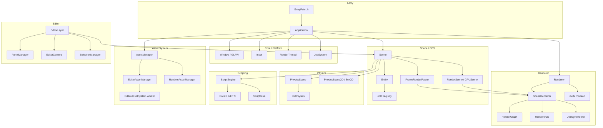

# LuxEngine Architecture Reference

Authoritative structural reference for agents and developers extending LuxEngine.

**This doc is structural, not API-level.** For function signatures, fields, and method lists, read
the header — it is the source of truth and never goes stale. Use this doc for system boundaries,
ownership, lifecycle, threading, extension hooks, and non-obvious invariants.

Companions: `.claude/docs/Conventions.md` (style + helper reuse), `.claude/docs/Building.md` (build
and regeneration), `.claude/docs/Threading.md` (thread contexts), `.claude/docs/Rendering.md`
(renderer invariants).

---

## Table of Contents

- [Part 1: System Overview](#part-1-system-overview)
- [Part 2: Per-System Notes](#part-2-per-system-notes)
- [Part 3: Cross-Cutting Concerns](#part-3-cross-cutting-concerns)
- [Part 4: Implementation Playbook](#part-4-implementation-playbook)
- [Part 5: Directory Map](#part-5-directory-map)

---

## Part 1: System Overview

LuxEngine is a C++20, Vulkan-only 3D game engine and editor. It is a solo project. It builds as a
static library (`Core`), a C# scripting assembly (`ScriptCore`), an editor application (`Editor`),
and a standalone runtime player (`Lux-Runtime`). Everything lives in the `Lux` C++ namespace.



### System summary

| System | Location | Key headers |
|---|---|---|
| Application / Core | `Core/Source/Lux/Core/` | `Application.h`, `Layer.h`, `RenderThread.h`, `JobSystem.h`, `Ref.h`, `Base.h` |
| Window / Platform | `Core/Source/Lux/Core/`, `Core/Platform/{Windows,Linux}/` | `Window.h`, `Thread.h` |
| Renderer | `Core/Source/Lux/Renderer/` | `Renderer.h`, `SceneRenderer.h`, `RenderGraph.h`, `FrameRenderPacket.h` |
| Vulkan backend | `Core/Source/Lux/Platform/Vulkan/` | `VulkanDeviceManager.h`, `DescriptorSetManager.h`, `ShaderCompiler/` |
| Scene / ECS | `Core/Source/Lux/Scene/` | `Scene.h`, `Entity.h`, `Components.h`, `SceneSerializer.h` |
| Physics 3D | `Core/Source/Lux/Physics/` (+ `JoltPhysics/`) | `PhysicsSystem.h`, `PhysicsScene.h`, `PhysicsShapes.h` |
| Physics 2D | `Core/Source/Lux/Physics2D/` | via `Scene.h` |
| Scripting | `Core/Source/Lux/Scripting/` | `ScriptEngine.h`, `ScriptGlue.h`, `ScriptBuilder.h` |
| Assets | `Core/Source/Lux/Asset/` | `AssetManager.h`, `Asset.h`, `AssetTypes.h` |
| Audio | `Core/Source/Lux/Audio/` | `AudioEngine.h`, `AudioEventInstance.h`, `RaytracedAudioScene.h` |
| Editor framework | `Core/Source/Lux/Editor/` | `EditorPanel.h`, `PanelManager.h`, `EditorCamera.h`, `SelectionManager.h` |
| Editor app | `Editor/Source/` | `EditorLayer.h`, `Panels/` |
| ImGui | `Core/Source/Lux/ImGui/` | `ImGuiEx.h`, `ImGuiUtilities.h`, `Colors.h` |
| Project | `Core/Source/Lux/Project/` | `Project.h`, `ProjectSerializer.h`, `UserPreferences.h` |
| Serialization | `Core/Source/Lux/Serialization/` | `AssetPack.h`, `StreamReader/Writer.h` |
| Social | `Core/Source/Lux/Social/` | `DiscordSocial.h` |
| Build | repo root | `premake5.lua`, `Dependencies.lua`, `scripts/` |

### System dependency rules

Violations block the editor/runtime split and are rejected in review.

| System | May depend on | Must NOT depend on |
|---|---|---|
| Scene / ECS | Asset, Physics, Core, Renderer *types* | `Editor/Source/**` |
| Physics | Scene (read), Core, Math | Renderer, Editor, ScriptEngine |
| Renderer / SceneRenderer | Scene (read, via packet), Asset, Core | `Editor/Source/**`, Physics, ScriptEngine |
| ScriptEngine | Scene, Asset, Core (via ScriptGlue) | Renderer, `Editor/Source/**` |
| Asset system | Core, Project | Renderer internals, `Editor/Source/**` |
| Editor panels | everything in `Core` | — (engine code never includes editor-app headers) |

Two notes specific to LuxEngine:

- `Scene.h` includes `Lux/Editor/EditorCamera.h` and `Renderer2D.h`. That is allowed: those are
  `Core`-owned editor *framework* types, not the editor application. The prohibition is on
  `Editor/Source/**`.
- `Core` must remain buildable and usable without `Editor`. `Lux-Runtime` is the proof — if a change
  breaks the runtime build, the dependency direction was violated.

---

## Part 2: Per-System Notes

### 2.1 Application lifecycle

`Application` (`Core/Source/Lux/Core/Application.h`) owns the window, layer stack, render thread,
event queue, application settings, and performance profiler. The client implements
`CreateApplication(argc, argv)` (see `EntryPoint.h`).

`ApplicationSpecification` carries name/size/vsync/fullscreen, `RendererConfig`,
`CoreThreadingPolicy`, `EnableSimulationThread`, `EnableImGui`, `EnableDiscordRichPresence`, and
`IconPath`.

**Construction order matters** and is not obvious: `s_MainThreadID` is captured, settings are
deserialized, `JobSystem::Init` runs, then `m_RenderThread.Run()`, and only *then* is the `Window`
created. The threading policy is therefore read from `App.lsettings` in `LuxEditorApp.cpp` *before*
the `Application` object exists, because `RenderThread` is constructed with it.

**Layers** (`Layer.h`, `LayerStack.h`): `OnAttach` / `OnDetach` / `OnUpdate(Timestep)` /
`OnImGuiRender` / `OnEvent`. `PushLayer` for regular, `PushOverlay` for top. The editor and the
runtime each supply one.

**Frame loop** — see `.claude/docs/Threading.md § The frame loop` for the exact ordering. Do not add
per-frame work directly to `Application::Run`; add it to a layer's `OnUpdate`.

**Events** are two-stage: `QueueEvent` / `DispatchEvent<T>` are thread-safe and deferred until
`SyncEvents()`; `DispatchEvent<T, true>` dispatches immediately (main thread only).

### 2.2 Window / Platform

`Window` (`Core/Source/Lux/Core/Window.h`) is created via `Window::Create(WindowSpecification)` and
owns the GLFW window, the `RendererContext`, and the `DeviceManager`.
`Application::GetGraphicsDeviceManager()` / `GetGraphicsDevice()` are the shortcuts to the nvrhi
device.

Platform-specific implementations are separate translation units under
`Core/Platform/Windows/` and `Core/Platform/Linux/` (`*FileSystem.cpp`, `*Thread.cpp`,
`*RenderThread.cpp`), selected by a premake glob on `os.target()`. Add a platform behaviour by adding
the file to **both** folders — not with `#ifdef` in shared code.

### 2.3 Renderer

Three layers (`Renderer` facade → `SceneRenderer` → `Renderer2D`/`DebugRenderer`) over NVRHI/Vulkan.

**Read `.claude/docs/Rendering.md` before changing anything here.** The invariants that are easy to
break and hard to see: the global `(set, binding)` namespace, pipeline caching, frame-indexed
resource release, and `RenderGraph::ComputeStructureHash` completeness.

Structurally:

- `SceneRenderer` owns a `RenderGraph` and rebuilds its description each frame, caching the compile
  behind a structure hash. The pipeline is deferred PBR: G-buffer, clustered (froxel) light culling,
  HZB + GPU mesh culling, GTAO, SSR, volumetric clouds, sky atmosphere, transparent forward, then
  post (TAA, auto-exposure, bloom, composite, SMAA, DOF).
- `RenderScene` / `GPUScene` / `MaterialScene` / `TextureScene` hold the persistent render-side
  mirror of the ECS, with `StaticMeshRenderProxy` entries and dirty flags. `Scene::SyncRenderScene`
  maintains them.
- `MaterialAsset` owns its scalar properties (albedo, metalness, roughness, emission, transparency,
  use-normal-map) in its own `Values` struct and mirrors them into the shader's push-constant block
  only where that block declares the member. The block is not a store: the opaque PBR shader has no
  `Transparency`, the transparent one has no material members at all. `MaterialScene` builds
  `GPUMaterialData` from the asset's values (the shader block is read only for a bare override
  `Material`, with fallbacks). Never read a material uniform with `Material::Get*` without
  `FindUniformDeclaration` first: in Release a missing member is an out-of-bounds read, not an assert.
- `FrameRenderPacket` is the per-frame snapshot that decouples submission from the live registry.
- `RendererConfig::FramesInFlight` defaults to 3.
- Selection outline jump-flood inputs are rebound inside the render queue for each iteration,
  because the ping-pong pass is reused. Mask/distance data uses point sampling. Selection wireframes
  use the on-top pass; collider wireframes use a cached depth-tested variant unless On Top is enabled.
  Both share the scene color target, and the graph declares the collider depth read. Collider colors
  are captured per frame and written to material storage in render-queue order.
- Tone mapping uses a color-only framebuffer sharing the composite color image. It samples
  PreDepth without binding it as an attachment; the depth-bearing composite framebuffer remains
  the target for world/editor overlays. Both framebuffer views participate in resize and stale
  attachment repair, and the graph declares only color as the tone-mapping output.
- Compute-to-draw barriers accept `StorageBufferSet` and resolve its render-frame buffer at
  recording time. Mesh culling, cluster lighting and exposure use this path; indirect draw
  arguments transition to NVRHI `IndirectArgument` before consumption. Mesh-culling output
  buffers use GPU-only storage with staged CPU initialization so NVRHI tracks their transitions.

### 2.4 Scene / ECS

`Scene` (`Core/Source/Lux/Scene/Scene.h`) derives `Asset` and owns the `entt::registry`, the
`Renderer2D`, the physics scenes (`PhysicsScene` 3D, `PhysicsScene2D`), the `ScriptStorage` and live
`CSharpObject` instances, runtime audio sources, and the UUID→entity map.

`Entity` (`Entity.h`) is a thin wrapper over `entt::entity` + `Scene*` with
`AddComponent<T>` / `GetComponent<T>` / `TryGetComponent<T>` / `HasComponent<T...>` /
`RemoveComponent<T>`. Templates live in `EntityTemplates.h`, included at the bottom of `Scene.h`.

**Components** (`Components.h`): `IDComponent`, `TagComponent`, `TransformComponent`,
`RelationshipComponent`; rendering (`MeshComponent`, `StaticMeshComponent`, `SubmeshComponent`,
`MeshTagComponent`, `SpriteRendererComponent`, `CircleRendererComponent`, `TextComponent`,
`CameraComponent`); lighting (`DirectionalLightComponent`, `PointLightComponent`,
`SpotLightComponent`, `SkyLightComponent`, `SkyAtmosphereComponent`, `VolumetricCloudComponent`,
`ExponentialHeightFogComponent`); physics 3D (`RigidBodyComponent`, `CharacterControllerComponent`,
`Box`/`Sphere`/`Capsule`/`Mesh`/`CompoundColliderComponent`); physics 2D (`RigidBody2DComponent`,
`BoxCollider2DComponent`, `CircleCollider2DComponent`); scripting (`ScriptComponent`,
`NativeScriptComponent`); audio (`AudioSourceComponent`, `AudioListenerComponent`);
`FolderComponent` (a purely organizational hierarchy grouping node — non-empty marker, kept out of
the transform/render paths); and `PrefabComponent`.

**Prefab instances:** an instantiated (or freshly created) prefab hierarchy carries a
`PrefabComponent{PrefabID, EntityID}` on every entity, linking each to its source entity inside the
prefab asset's scene. `SceneSerializer::GetOverriddenComponentKeys(instance, source)` diffs the two
entities' serialized component blocks to surface per-component overrides in the inspector, and
`Scene::ReconcilePrefabComponents(dst, src)` makes one entity's prefab-tracked components match the
other exactly (replace/add/remove) — together backing the editor's per-component and all-at-once
**Revert** (source → instance) / **Apply** (instance → source, then re-serialize the asset). True
**Variant prefabs** are self-contained prefabs that carry a `BasePrefab` handle (`Prefab::GetBasePrefab`),
serialized as an optional top-level `BasePrefab` key by `PrefabSerializer::WritePrefabFile` (the single
prefab-write path, so the base link survives every save). A variant instantiates like any prefab; on
saving a base, `EditorLayer::PropagateToVariants` refreshes each derived variant asset via
`Scene::AdoptPrefabBaseEdits` (UUID-matched, un-overridden entities adopt the base edit). **Prefab edit mode**
(EditorLayer) swaps the editing context to a copy of the prefab's scene (`ApplyEditorScene`, shared
with `OpenScene`); on save it writes the asset and calls `Scene::PropagatePrefabEdits`, which
refreshes un-overridden instances in the returned scene to the edited prefab's values.

**Lifecycle:** `OnRuntimeStart` / `OnRuntimeStop` (physics + scripts), `OnSimulationStart` /
`OnSimulationStop` (physics only), and the per-mode updates `OnUpdateRuntime` /
`OnUpdateSimulation` / `OnUpdateEditor`.

**Rendering entry points:** `OnRenderEditor` / `OnRenderSimulation` / `OnRenderRuntime`, built on
`BuildRenderPacket*` + `SubmitRenderPacket`. `Render3D` / `Render3DRuntime` are the higher-level
orchestrators.

**Conventions:**

- `UUID` is stable across save/load and scene copies; `entt::entity` handles are not. Identify by
  UUID anywhere that crosses a frame, a file, or a duplication.
- The registry is **not** thread-safe; mutation is main-thread only.
- Destroying an entity mid-iteration invalidates views — use `SubmitToDestroyEntity`, which defers
  into `m_PostUpdateQueue`.
- `Scene::Copy` / `CopyTo` back play-mode duplication; a component that isn't copied there silently
  vanishes on Play.

### 2.5 Physics (3D — Jolt)

Layered so the backend can be swapped:

- `PhysicsAPI` (`PhysicsAPI.h`) — backend interface; `JoltAPI` is the only implementation.
- `PhysicsSystem` (`PhysicsSystem.h`) — static facade: init/shutdown, mesh cooking, scene factory.
- `PhysicsScene` / `PhysicsBody` — the world and its bodies (`JoltScene`-equivalent logic in
  `PhysicsScene.cpp`, `JoltBody`).
- `PhysicsShapes.h` — box, sphere, capsule, convex mesh, triangle mesh (static only), compound.
- `CharacterController.h` / `JoltCharacterController`.
- `PhysicsLayer` / `PhysicsLayerManager` — collision filtering.
- `SceneQueries.h` — raycasts, shape casts, overlaps.
- `MeshCookingFactory` / `MeshColliderCache` — mesh colliders are cooked and cached, not rebuilt.
- `PhysicsCaptureManager`, `PhysicsContactCallback`, `PhysicsSettings`.

Stepping is driven by `Scene::StepPhysics(ts)` from the scene update — there is **no** fixed-phase
scheduler in LuxEngine.

### 2.6 Physics (2D — Box2D)

`Core/Source/Lux/Physics2D/`, driven directly by `Scene` (`OnPhysics2DStart` / `OnPhysics2DStop`).
No abstraction layer — Box2D is small enough to use directly.

### 2.7 Scripting (C# / Coral)

`ScriptEngine` (`Scripting/ScriptEngine.h`) hosts .NET 9 through Coral (`Core/vendor/Coral/`).

- Host lifecycle: `InitializeHost` / `ShutdownHost`, then `Initialize(project)` / `Shutdown`.
- Assemblies: `LoadProjectAssembly` (editor, from disk), `LoadProjectAssemblyRuntime(Buffer)`
  (runtime, from an asset pack), `ReloadAppAssembly` (hot reload), `BuildAssemblyCache`.
- `ScriptGlue.cpp` registers every internal call. **All new internal calls go there** — never in
  `ScriptEngine.{h,cpp}`.
- `ScriptEntityStorage.hpp` holds per-entity field values (`ScriptStorage`, serialized with the
  scene); live objects are `CSharpObject` instances on the `Scene`.
- `ScriptBuilder` shells out to build the project's C# assembly.
- `ScriptFieldMetadata::HasMethod(name)` gates lifecycle invocation so the engine doesn't call hooks
  a script doesn't define.

The Coral host assembly is deployed to `Editor/DotNet/` by `Core`'s premake post-build step (see
`.claude/docs/Building.md`). Managed references are invalidated on reload — never cache them across
frames.

### 2.8 Asset system

`AssetManager` (`Asset/AssetManager.h`) is a **static facade** over `AssetManagerBase`, resolved
through `Project::GetAssetManager()`. Two implementations:

- `EditorAssetManager` — file-backed, owns the `AssetRegistry` (`AssetHandle` → `AssetMetadata`).
- `RuntimeAssetManager` — loads from a packed `AssetPack`.

Asset types (`AssetTypes.h`): `Scene`, `Prefab`, `Mesh`, `StaticMesh`, `MeshSource`, `Material`,
`Texture`, `EnvMap`, `Audio`, `SoundConfig`, `SpatializationConfig`, `Font`, `Script`, `ScriptFile`,
`MeshCollider`, `SoundGraphSound`, `Skeleton`, `Animation`, `AnimationGraph`.

Serializers live beside the importers (`MeshSerializer`, `TextureSerializer`, `MaterialSerializer`,
`SceneAssetSerializer`, `AudioAssetSerializer`, plus `*RuntimeSerializer` variants) and are wired up
in `AssetImporter.cpp`. Extension → type mapping is in `AssetExtensions.h`.

Rules:

- Reference assets by `AssetHandle`, never by path after import.
- Memory-only assets (procedural meshes, runtime textures) are registered with
  `AssetManager::AddMemoryOnlyAsset` and live in a **separate map** (`m_MemoryAssets`, guarded by a
  `std::shared_mutex`), queried via `IsMemoryAsset`. They are *not* marked with a flag —
  `AssetFlag` has only `None`, `Missing`, and `Invalid` (`AssetTypes.h`). Don't look for a
  `MemoryOnly` flag; there isn't one.
- Engine code must work against **both** managers — no editor-only assumptions.
- Async: `GetAssetAsync` + `SyncWithAssetThread()`; the worker is `EditorAssetSystem` /
  `RuntimeAssetSystem` (see `.claude/docs/Threading.md`).
- Dependencies: `RegisterDependency(dep, handle)` so a reloaded texture notifies its materials.

### 2.9 Editor

Split between engine-owned framework (`Core/Source/Lux/Editor/`) and the editor application
(`Editor/Source/`).

- `EditorPanel` (`Core/.../Editor/EditorPanel.h`) — `RefCounted` base with `OnImGuiRender(bool&
  isOpen)`, plus optional `OnEvent`, `OnProjectChanged`, `SetSceneContext`, `OnClose`.
- `PanelManager` — `AddPanel<T>(category, strID, isOpenByDefault, args...)`, `GetPanel<T>(strID)`,
  `RemovePanel`, and `Serialize` / `Deserialize` of open state. Panels are grouped by
  `PanelCategory`.
- `SelectionManager`, `EditorCamera`, `EditorConsolePanel` + `EditorConsole/`,
  `SceneHierarchyPanel`, `EditorResources`, `FontAwesome.h`.
- `EditorStack` (`Core/.../Editor/EditorStack.h`, header-only, main-thread singleton) — undo/redo
  *signal*. It carries a "scene edited" flag; `ImGuiEx::Property` raises it on every field edit (gated
  by the `UndoDo` macro), and non-widget edits call `MarkSceneEdited("label")`. `EditorLayer` turns the
  flag into a **labelled, per-entity diff** step: it splits the scene via
  `SceneSerializer::SerializeEntitySnapshots` (per-entity YAML + meta) and stores only the changed
  entities, so history is O(change). Restore reassembles the full scene and runs the whole-scene
  deserialize (`DeserializeFromSnapshots`), which keeps it safe against the two-way parent/child links.
  Value-based, so nothing dangles. Non-scene edits (renderer/project settings) push closure commands
  (`CustomUndo`/`CustomRedo`, via `EditorLayer::PushUndoCommand`) onto the same stack, so one `Ctrl+Z`
  covers everything. Selection is restored per step; a `UndoHistoryPanel` (View → History) shows the
  stack. Play/Simulate get a separate transient history (discarded on Stop; undo there rebuilds and
  restarts the runtime). Resets on scene load. Full design + phased plan: `docs/Editor/Undo-Redo.md`.
- Editor app panels (`Editor/Source/Panels/`): ContentBrowser (+ `ContentBrowser/`),
  ApplicationSettings, ProjectSettings, AssetManager, MaterialEditor (+ `MaterialEditor/`),
  LightSettings, SceneRenderer, RenderStats, RendererDebugger, AudioDebug, TextEditor, ThumbnailCache.
- Material editing (`Panels/MaterialEditor/`): `MaterialEditorPanel` (View → Material Editor) edits
  `MaterialAsset`s in tabs with explicit Save/Revert; each finished edit is one closure command via
  `PushUndoCommand`. It opens from a Content Browser double-click (item-activate callback for
  `AssetType::Material`) and from the Inspector's per-slot Edit buttons
  (`SceneHierarchyPanel::SetOpenMaterialCallback`). `MaterialPreview` is a private `Scene` + `Viewport`
  (own `SceneRenderer`, `EnableEditorRenderTargets = false`) showing one default mesh from the
  project's `Meshes/Source/Default/`; `MaterialThumbnailer` owns a second preview and renders one
  stale material thumbnail at a time for the Content Browser, reading pixels back **on the render
  thread** (`Renderer::Submit`) and handing CPU pixels to `ThumbnailCache::SetThumbnailPixels`, so it
  never does a main-thread GPU readback.
- `Editor/Source/EditorLayer.{h,cpp}` is the orchestrator. Prefer adding a **panel** over adding code
  to `EditorLayer`.
- `Editor/Source/RuntimeExportUtils.{h,cpp}` builds the standalone runtime package.
- Viewport transform gizmos operate on world matrices and convert edits back through the parent
  transform. Translation, rotation, and scale have separate snap increments (also available with Ctrl).
  The six-axis view widget uses `EditorCamera::SetOrbitState`; camera view construction uses the
  orientation's up vector so top/bottom views remain valid. Icons use world positions and selected
  mesh bounds use only that mesh's submeshes. 2D collider overlays match Box2D's radius/offset
  convention and share the 3D collider scope, color, and On Top controls.

UI style: use `ImGuiEx` scopes and widgets and `Colors::Theme` constants — see
`.claude/docs/Conventions.md`.

### 2.10 Audio

FMOD Studio is the only playback path. `AudioEngine` owns Studio and its Core mixer;
`AudioEventInstance` owns Studio event handles. `AudioSourceComponent` remains the entity-facing
component (and C# API), with volume, pitch, play-on-awake, event references and parameter overrides.
`AudioSource` raw-file voices, direct Core listener updates, the extra Core update pump, and the
engine-created `Reverb3D` unit are removed. FMOD Core remains a dependency for mixer statistics and
`AudioFileUtils` metadata inspection (`FMOD_OPENONLY`); inspecting a source asset does not play it.
FMOD and Vercidium Audio are mandatory SDK dependencies, deployed beside both applications.

**Legacy scenes:** old `Audio` handles and `Looping` values are retained as migration-only
`LegacyAudio`/`LegacyLooping`, under their original YAML keys. They survive save, copy, undo and
prefab roundtrips, but cannot create voices. A source with a legacy handle and no Studio event
shows an inspector migration warning and reports an error on Play. Assign an authored Studio
event; the engine cannot infer event GUIDs or recreate Studio authoring from a raw asset. New
sources do not write legacy keys. Looping is authored in the event timeline.

**Acoustics:** `Scene` owns a `RaytracedAudioScene`, which wraps VA behind a Pimpl. Runtime start
mirrors mesh-collider triangles into VA primitives owned by that scene. Each frame joins the
previous VA batch with `WaitForResults`, applies the geometry queue, updates the dominant listener
and source emitter positions, reads completed results, then launches the next batch with
`OnUpdate`. Joining before mutation and teardown is mandatory. VA simulates one listener: highest
weight wins, lowest index breaks ties, and an attenuation target overrides its acoustic position.

Event components receive `AudioEventAcoustics`: low-frequency direct gain becomes the optional
Studio parameter `Occlusion` (1 minus gain), and returned energy becomes `ReverbSend`. Studio
authors the filters, sends and reverb buses. VA's other bands and EAX measurements remain diagnostic
outputs; the engine does not apply a second filter/reverb path. Missing optional parameters are
expected; other FMOD failures are reported. Standalone scripted events do not register VA emitters.

**Acoustic materials (Phase 7):** `AcousticMaterial.h` defines stable engine tags, independent of
VA's enum. `MeshColliderComponent::Acoustic` defaults to Default (concrete). An
`AudioSurfaceComponent` on the same entity overrides that tag, including an explicit Default;
without a mesh collider it is metadata only. Both tags survive scene snapshots, copy/duplicate,
prefab instantiation/reconciliation and runtime scene serialization. C# exposes the effective tag
through `MeshColliderComponent.Material` and `AudioSurfaceComponent.Material` as read-only queries.
Physics friction/density/restitution and renderer materials remain independent.

**Dynamic geometry and portals (Phase 13):** `Scene::SyncAudioGeometry` captures mesh collider
metadata and world transforms into a scene-owned `AudioGeometrySystem`. Static/Dynamic/Disabled
acoustic motion is independent of physics. Static captures its transform; Dynamic tracks hierarchy
movement; Disabled omits the collider. Local triangle batches include submesh transforms and use
the same selection rule as physics (valid index selects one; otherwise all). Changed transforms
and tags update an existing VA primitive; mesh/submesh selection changes rebuild only that node.
The queue coalesces edits and limits active frames to eight primitive updates, stopping after
65,536 affected vertices (a soft threshold because a mesh update is indivisible). Startup drains
all work. Removal bypasses rebuild work. Failed replacements retain the prior geometry and report
an error; invalid authored inputs are reported and removed. In-place mesh asset hot reload and
deformation require restarting Play. Per-tag coefficient settings remain captured at Play start.

`AudioPortalComponent` supplies a local rectangular VA shutter that retracts toward -X as Open
increases, disappearing at Open=1. It can link two AudioZone entities. `AudioZoneSystem` transfers
a distance/open-weighted share of each listener's zone weights across those links, normalizing
outgoing shares and applying only one hop so cycles/multiple openings cannot amplify weight.
Room transfer uses the shutter's last applied Open while VA is running. Portal references remap
through duplicate/prefab paths; C# setters and the inspector edit the same component data. Selected
portal wireframes are copied into `FrameRenderPacket::AudioZoneLines` on the main thread. VA nodes
and their local bounds/counts are owned by `RaytracedAudioScene`; world bounds expand for movement.
All geometry mutations occur after the previous VA worker batch joins. See
`docs/AUDIO_DYNAMIC_GEOMETRY.md` for authoring, scheduling and acoustic approximation limits.

Each engine tag gets its own VA custom material ID (`1000 + stable tag ID`), so overrides cannot
leak between tags that share a preset. Most tags map directly; Default uses Concrete, Carpet and
Rubber use Cloth, Plaster uses Gyprock, Plastic and WoodThin use WoodIndoor, Soil uses Mud, Wood
uses WoodOutdoor, Ceramic uses Tile, and Foliage uses Leaf. These are editable starting presets,
not measured coefficients for every real-world material.

Project Audio settings expose per-tag overrides for LF/HF absorption, scattering, LF/HF
transmission distance in metres, and LF/HF energy loss on thin/open geometry. Defaults come from
the installed VA SDK. Absorption/scattering must be finite and in 0..1; transmission distances
must be finite and positive; flat losses must be finite and nonnegative. Invalid settings fail
loading/export with an audio error. YAML writes enabled overrides under `Audio.AcousticMaterials`;
missing entries use SDK presets. Runtime format 18 appends a bounded explicit override block after
the bank manifest, keeping `ProjectInfo`'s fixed layout unchanged. Formats 16/17 remain readable
and use default material settings. Unknown or duplicate IDs and truncated blocks fail loading.

**Zones and snapshots (Phase 8):** `Scene` owns `AudioZoneSystem` and supplies resolved volumes
on the main thread after listener synchronization and the VA join. `AudioZoneComponent` supports
box/sphere volumes or exactly one box, sphere or capsule collider on the same entity. Mesh and 2D
colliders are unsupported; missing/ambiguous primitive colliders and invalid geometry log once
until corrected. Box dimensions/offsets follow the world transform. Sphere radius uses maximum
world scale; capsules use maximum X/Z radius scale and Y half-height scale, matching primitive
physics scaling. These are containment volumes, independent of collision callbacks.

Weights rise inward from the boundary over `BlendDistance` world metres. For each active listener,
higher priorities consume available weight first; equal priorities share their capped coverage
proportionally. Listener weights are normalized and combined into the global mixer result;
attenuation targets also determine zone occupancy. No active listener means zero target weights.
`FadeTime` smooths entry/exit in seconds and freezes during scene pause. Ambience must be a looping
Studio event. One ambience instance is cached per entity, placed at its volume center, and receives
`Volume * Weight`; it starts on entry and stops on exit, retaining ownership through FMOD fade-out.
Entity/component removal and scene teardown release voices. Missing banks retry on catalog revision;
bank/system reload generations invalidate and recreate active wrappers safely.

Zone snapshot contributions are coalesced by canonical GUID into one instance: FMOD averages
multiple instances of the same snapshot, so separate instances would weaken overlap. `Intensity`
must be exposed from the snapshot dial as a local continuous writable 0–100 Studio parameter.
`SetSnapshotIntensity` takes normalized 0–1, validates type/range, caches the parameter ID and
sets intensity before playback. Event volume does not control snapshot intensity. A missing or
mis-authored snapshot reports an error and does not suppress VA reverb. Snapshot mixer scope,
priority and transition curves remain authored in Studio. Explicit script-created snapshots are
independently owned and can still interact with zone snapshots under FMOD's averaging rules.

Project `Audio.ZoneReverbMode` selects Layered (default), PreferZones (scale source VA `ReverbSend`
by one minus active zone snapshot coverage), or PreferRaytraced (suppress zone snapshots while
VA ambience is valid, falling back to zones otherwise). This policy leaves VA occlusion and zone
ambience beds independent. The latest joined VA validity is retained while paused. Runtime format
19 adds one validated mode byte after the version-18 materials block; versions 16–18 use Layered.

Zone data survives scene YAML, runtime scenes, copy/duplicate and prefab operations. The inspector
provides typed bank event/snapshot pickers, dimensions, blending and a runtime weight. Selected
volumes and inner full-weight margins are captured as `FrameRenderPacket::AudioZoneLines`; the
render callback consumes only those immutable lines. C# exposes `AudioZoneComponent` and
`Audio.StartSnapshot(reference, intensity)`, returning the usual explicitly owned `EventInstance`.
See `docs/AUDIO_ZONES.md` for authoring and verification.

**Banks:** `AudioBankBuilder` locates Studio's command-line tool and builds banks with
`-build -export-guids`. Its stale check compares authored input to built bank timestamps and skips
Build, caches, user state and .git. Tool lookup is cached for editor queries. Studio project paths
are asset-relative, and bank output paths are relative to the .fspro directory. The Content Browser
treats Studio project directories as opaque; `.fspro` and `.bank` activation opens Studio.
`EditorLayer` loads banks on project open and reloads after rebuilding for Play. Failed Play-time
builds log and retain existing banks; export uses the stricter validation described below.

Studio owns Core: initialize Studio once, obtain its Core system, and release only Studio at
shutdown. Initialization failures leave the initialized flag false. `AudioEngine::Update` pumps
Studio only; it manages its Core mixer internally. Live update follows project settings except in
Dist. `LoadBanks` loads strings first and replaces the previous set after validating the directory.
A partial directory load reports failure. `LoadBank` is additive and idempotent by canonical path.
Bank catalog revision changes retry failed event lookups; lifetime generation changes only when
unloading banks or shutting down and invalidates all old event wrappers.

**Runtime exports (format 19; bank manifest introduced in 17):** `AudioBankManifest` is an explicit, bounded stream block after
`ProjectInfo`'s unchanged fixed-size header. It carries an asset-relative directory, the exact bank
filenames, and the live-update setting (disabled for Dist exports). Never put owning strings or
vectors into the raw `ProjectInfo` block. Older formats load without Studio configuration and warn
that a re-export is needed for events; authoring paths and rebuild-on-play are disabled at runtime.

`RuntimeExport::PrepareAudioBanks` runs once during the existing synchronous export operation on
the main thread. It rejects missing authoring input, missing/empty banks, a missing master/strings
pair, and stale output using `AudioBankBuilder::NeedsRebuild`. The selected bank-output directory
is the enabled host desktop profile's FMOD output, or the project's default output; export does
not invoke Studio or guess a platform. An empty Studio project setting means no authored banks.
Bank paths inside Assets retain their relative location for scripts; external output is packaged
under `Assets/Audio/Banks`. Absolute authoring paths are not portable script paths. The `.fspro`
and source audio are not copied. FMOD Core/Studio and VA shared libraries are required copies,
including Linux's `lib` subdirectory. Copy failures abort export.

The player also requires the shared ImGui fonts and managed host at top-level `Resources/` and
`DotNet/`. Linux post-build directory copies target their parent to merge correctly on repeat
builds. Export audio validation failures are surfaced in the export window with the scene/entity
location; validation includes all registered scenes, not just the startup scene. The sample
`AudioTest` scene uses the same FMOD `event:/Fart` as its replacement demo, with no raw-file source.

`Project::LoadRuntime` initializes FMOD and loads only the manifest's banks, strings first, before
loading scenes or starting scripts. Failure clears partial loads and rejects the project. The exact
manifest prevents obsolete banks left in a reused export directory from being auto-loaded. Scripts
can still load additional banks explicitly. Bank load paths are relative to the packaged Assets,
and the normal idempotent `Audio.LoadBank` behavior applies to banks already loaded at startup.
This does not implement acoustic materials or cross-platform bank compilation.

**Listeners:** `AudioListenerComponent` stores authored `Active`, `ListenerIndex` (0–7), `Weight`
(0–1), `UseAttenuationTarget`, and `AttenuationTarget` (entity UUID). The obsolete listener cone
fields and component-owned runtime `Ref` are removed. Old YAML without the new keys retains an
active listener at index 0 with weight 1; old cone keys are ignored. Listener data is copied through
scenes, duplication, and prefabs. References inside cloned hierarchies are remapped after all
entities exist; duplication preserves external scene targets, while prefab creation clears them.
Prefab apply/revert maps references within the correct instance root, and override comparisons
compare targets in instance UUID space.

`Scene::SyncAudioListeners` runs on the main thread before initial playback and after scripts/physics
on runtime updates, including paused updates. It submits a complete fixed-size snapshot to
`AudioListener::Apply`; adding/removing a component during Play requires no backend object allocation.
World-transform columns provide local -Z forward and +Y up; the bridge orthonormalizes scaled/sheared
bases and supplies a stable orientation for collapsed axes. Scene-owned previous positions provide
velocity, reset on start, slot reassignment, and paused frames. Non-finite transforms and invalid
indices/weights are rejected with rate-limited diagnostics. Duplicate active indices choose the
lowest UUID deterministically and report the conflict.

Studio receives every populated slot, zero weights for holes, and normalized weights. A missing
listener resets Studio to a neutral origin listener (Studio requires a nonzero total). Missing
attenuation targets fall back to the listener position with a diagnostic. Stopping Play resets
listener state. Only Studio's listener API is written; Studio owns propagation to its Core mixer.

**Event playback:** `Scene` owns an `AudioSourcePlayback` per source entity, with an optional
`AudioEventInstance`. The cache is keyed by UUID and checked against the assigned event GUID and
bank revision; failed lookups are cached until the assignment or banks change. Playback intent,
parameter overrides and timeline survive distance culling without keeping a Studio instance.
Wrappers independently check `AudioEngine::GetEventGeneration()` for handle validity. Bank unload/system shutdown
advance the generation before invalidating handles. Wrappers check it before any FMOD call, including
destruction, so externally held references cannot touch a released system. These APIs are main-thread
only. Component removal, entity destruction, and scene stop explicitly stop instances before dropping
the scene's references.

Assigned Studio events are the only playback path at startup and on later updates.
Creation applies serialized parameter overrides, world position/orientation, volume, and pitch before
PlayOnAwake; a completed one-shot is not restarted on the next frame. Emitters face local -Z, with
their basis orthonormalized for scaled/sheared transforms. Scene pause is layered over the caller's
pause state, so resuming the editor does not unpause a gameplay-paused event. Event components participate in ray-traced acoustics.

`AudioEventRef` persists GUID, advisory path and bank name; `ParameterOverrides` persists name/value
pairs through scene/prefab serialization and undo snapshots. Runtime instances are never serialized
or shared by scene copies. The picker follows a new selection/assignment, then preserves the chosen
bank filter while browsing. Events without a strings-bank label display their GUID; path buffers are
sized from FMOD's reported length rather than truncating long event paths.

`SetBusVolume` / `GetBusVolume` drive the mixer buses the sound designer authored (`bus:/`,
`bus:/SFX`). The engine never invents the bus hierarchy — an unknown path returns false/0, which is
the normal answer for a project that has not authored that bus.

**Gameplay scripting (Phase 4):** `AudioScriptBindings` registers the managed `Audio`,
`EventInstance`, `AudioSourceComponent`, and `AudioListenerComponent` APIs. All calls run on the
main thread. Component state belongs to the scene; standalone events belong to a native registry
with monotonically allocated handles, never managed raw pointers. `Dispose` releases an event;
scene stop and assembly reload release the registry and invalidate managed wrappers. One-shots
must be authored as finite events and are collected after playback. An event path requires loaded
strings-bank metadata; GUID references do not. Component controls operate exclusively on events.

FMOD callbacks copy handle/marker notifications into a mutex-protected bounded queue. The scene
drains it before script updates, dispatching managed callbacks on the main thread; late callbacks
for disposed handles are discarded. Script pause is separate from scene pause, and explicit Play
or Stop consumes pending PlayOnAwake. Managed strings are scoped and freed after internal calls.
Snapshot convenience methods and music are implemented; dialogue remains in its later roadmap
phase. New binding/managed files require Premake regeneration for both native and C# projects.

`Audio.LoadBank(bankFile)` synchronously loads an additional bank during scene setup. Relative
paths resolve beneath the active project's Assets directory; absolute paths are accepted. Load the
master and strings bank before calling event paths. Repeated loads of the same canonical file are
idempotent; adding banks preserves existing event handles. The bank catalog revision retries failed
component lookups without restarting existing playback. Directory reload still invalidates all old
handles. Banks remain engine-owned until bank reload or engine shutdown.

**Interactive music (Phase 10):** `Scene` owns one noncopyable `MusicDirector`, independent of
entity event instances. `MusicDirectorComponent` serializes startup event GUID/path/bank, optional
State label, Intensity, and PlayOnAwake. It participates in scene copy, duplication, prefab creation,
reconciliation, and the inspector. Runtime instances never belong to the component. On startup the
lowest director UUID wins (duplicate owners report an error), before managed OnCreate. Removing the
owner or stopping the scene clears its music. Without a component, scripts start the scene service.

The director accepts continuous 2D beds and finite 2D stingers, excluding snapshots. Parameters are
local authored `State` labels, `Intensity` 0–1, and `Layer_<name>` 0–1. State changes do not restart
the bed. One prepared, unstarted replacement may wait for a future beat/bar/marker/`Section:` marker;
its old bed stops immediately before the new one starts. This main-thread transition is
frame-quantized: sample-accurate composition stays inside Studio's authored event transitions.
Failed replacement validation retains the current bed. Notifications received before a transition
request cannot trigger it. Reentrant callbacks changing/stopping playback invalidate the rest of the
old batch. Pause freezes playback and callback dispatch; fades retain references until completion.
Bank reload cancels queued replacements/stingers and recreates the active bed with its parameters,
from timeline start. Scene transitions do not preserve musical position.

`AudioEventInstance` callback userdata is a never-reused numeric token into a mutex-protected state
map, not a wrapper pointer. Destruction removes its mailbox before stopping/releasing the SDK
instance, even if a bank generation invalidated the handle. Script stopped/marker notifications and
per-instance music timeline mailboxes drain independently. Timeline payloads copy position,
bar/beat, tempo, signature, marker text and a sequence counter; callbacks never enter Scene/Coral.
The existing audio bridge attaches managed `Music.Beat`/`Marker` dispatch before the scene updates
its director, before script OnUpdate. Scene/assembly reset clears managed subscriptions. Callback
mailboxes are bounded with overflow reported on the main thread. Music/scene serialization travels
through the existing runtime scene pack and existing exported banks, without a new project format.
See `docs/AUDIO_MUSIC.md` for authoring contracts and timing limits.

**Dialogue and subtitles (Phase 11):** `Scene` owns `DialogueDirector`, configured before script
OnCreate from `ProjectAudioSettings::Dialogue` (table asset handle and language). `.ldialogue`
`DialogueTable` assets contain keyed event references, priorities, interruptibility and per-language
subtitle text, speaker names and FMOD audio-table keys. AssetImporter registers the bounded YAML
serializer for editor files and packed runtime data; assigned project tables are included in each
exported scene's asset set. Runtime project format 21 appends dialogue settings after the format-20
surface table; older files default to no dialogue table and English. Startup snapshots the table so
editor edits cannot mutate an active scene's scheduling data.

The main-thread director owns one foreground voice, a stable priority queue (64 pending), separate
positional barks (32 active), bounded nearby-key cooldown history, and references retained through
fades (128 total prepared/active/fading voices). Queue/Interrupt/DropIfBusy policies preserve the
current voice when replacement validation fails; noninterruptible or higher-priority lines queue
interrupt requests. Barks require interruptible finite 3D events. Locale fallback resolves audio and
text together; queued requests retain their resolved translation. Pause freezes playback and cooldowns;
speaker destruction, scene teardown and bank generation changes cancel affected voices. Bank reload
does not replay previously spoken lines.

Programmer instruments use `AudioEventInstance::SetProgrammerSound` with a loaded FMOD audio-table
key, checked before Start. CREATE obtains the Studio/Core systems from the callback event and creates
the SDK sound without retaining pointers to Scene or the wrapper; DESTROY releases it even after its
mailbox token has been removed. Started/sound-played/stopped/failure status crosses the mutex-protected
mailbox. Source sound length supplies advisory subtitle duration. Programmer subtitles wait for actual
sound playback. Ordinary finite authored events also work with an empty audio key.

`SubtitleEvent` reports shown/hidden, handle, key, resolved language/text, speaker name/UUID/world
position, offscreen status and duration. Scene resolves entities and its primary camera on the main
thread. Notifications dispatch after voice mutations, so listeners can enqueue/stop/clear dialogue.
Native and script listeners are independent. C# `Dialogue`, `DialogueHandle`, and immutable `Subtitle`
expose speech, barks, queue control, language selection and shown/hidden events through the existing
AudioScriptBindings bridge. Reset hides managed subtitles and clears subscriptions. Position/offscreen
fields are event snapshots; custom game UI owns ongoing speaker tracking. Phase 12 also supplies an optional built-in presentation. Project Settings
provides table selection, startup language and line/translation editing; Content Browser creates tables.
See `docs/AUDIO_DIALOGUE.md` for setup, authoring contracts and scripting examples.

**Audio accessibility (Phase 12):** `AudioAccessibility` is a main-thread service for the active
runtime scene. A non-owning scene identity controls teardown; source tracking uses `WeakRef` plus
never-reused playback tokens and does not extend event lifetime. It observes existing FMOD playback
mailboxes, publishes opt-in localized event captions through `DialogueDirector`, and exposes bounded
subtitle presentation and sound cue snapshots. Caption handles reserve the high bit; dialogue handles
use the lower 63 bits. Captions and descriptions carry explicit flags through native/C# subtitle APIs.
Source position/offscreen data refreshes the built-in presentation, and cue direction is relative to
the primary listener. Cue intensity is authored importance times instance volume and linear range
falloff, deliberately independent of player bus volume, not measured acoustic loudness.

`ProjectAudioSettings::Accessibility` stores defaults, category bus mappings, event GUID metadata,
localized caption strings and speaker colors. YAML loads missing fields with defaults. Runtime format
22 appends a bounded length-prefixed configuration after dialogue settings; older exports retain
defaults. Player preferences live separately under persistent storage, keyed by sanitized project
name, and are saved explicitly with `FileSystem::ReplaceFileAtomically` after writing a complete temporary file.

`AudioAccessibilityMixer` owns FMOD gain DSPs on mapped Studio buses plus mono/compressor DSPs on
Core master output. Setup locks channel groups and flushes commands once; bank revision changes
reconfigure the cached graph. `AudioEngine::UnloadAllBanks` releases it before unloading banks.
Player gains multiply authored/gameplay volumes. Mapped non-master buses must not contain each other.
Description playback uses `DialogueDirector::Describe`, the existing priority queue, and an opt-in
preference; non-dialogue category gains duck while narration plays/fades. Narration must be authored
on the Dialogue bus. Full/Reduced/Night compression and mono apply to final output.

Core's `ImGuiEx::AudioAccessibilityOverlay/Menu/Options` are shared by editor and standalone runtime.
Project Settings authors defaults/metadata. F10 opens live player controls; runtime enables ImGui and
pauses/releases the cursor while the menu is open, restoring state on close/scene stop. Built-in UI
can be disabled for custom game UI. C# `Accessibility` exposes preferences, save, speaker colors,
cue start/end notifications and moving snapshots; reset clears subscriptions and ends active cues.
Raw subtitle/cue notifications remain unfiltered for custom consumers. See
`docs/AUDIO_ACCESSIBILITY.md` for setup, ranges, persistence and authoring contracts.

**Surfaces and physics audio (Phase 9):** `AudioSurfaceTable` is a `.lsurfaces` asset with
per-material footstep/impact/scrape/roll GUID references and shared thresholds. `AudioEventRef`
lives in Audio rather than Components so assets do not depend on the scene module. The project
stores its table handle in YAML and runtime format 20; AssetPack includes it with every scene.
`AssetManager::ImportAsset` / `SaveAsset` provide editor asset operations through the facade and
reject runtime managers. Asset-pack serialization returns failure to the export caller when any
scene/asset or output write fails; `FileStream` reports the underlying I/O result.

`PhysicsScene::Impl` owns a `JoltContactListener` that outlives the Jolt system. Worker callbacks
capture body sequence IDs/subshape IDs, UUIDs, contact position, masses, estimated impulse and
slip/roll speeds under a queue mutex. They never read ECS, acquire body locks or call FMOD.
`DrainContactEvents` swaps reusable vectors after simulation; simulation-only scenes drain without
playback. Speculative contacts are silent, and Persist can supply the first real impact.

`SceneAudioSurfaces.cpp` resolves contact IDs and material/table overrides on the main thread.
The scene-owned `PhysicsAudioSystem` owns impact/footstep instances, cooldowns, contact state and
one scrape/roll pair per body pair (coalescing compound manifolds). It retains retiring instances
through authored fade-outs, handles scene pause and bank generations, and clears entity-owned
voices on destruction. Jolt sleep produces contact removals. Surface component removal also clears
its runtime audio/cadence. Automatic footsteps are opt-in horizontal-distance cadence plus a
walkable-ground ray query; `Audio.PlayFootstep(Entity, speed, weight, probeDistance)` exposes the
same query for scripts. This layer does not implement character motion and currently targets 3D
Jolt, not Box2D. See `docs/AUDIO_SURFACES.md` for authoring and parameter contracts.

**Voice budgets and validation (Phase 14):** `AudioPerformanceSettings` persists in project YAML
and runtime format 23 (bounded YAML block after accessibility; older versions use defaults).
`AudioEngine::Init` configures the global FMOD software-channel cap before initialization.
`AudioPerformance` samples real/virtual channels, Studio/Core CPU, FMOD allocator memory
(nonblocking, valid with release SDKs) and configured bus input peak/RMS every 250 ms. It owns locked Studio bus groups
and one pass-through fader DSP per metered bus (inserted at index 1, directly behind the head DSP),
detaching and releasing them before bank unload. **Never enable metering on a DSP Studio created:**
with Live Update on, that makes every later `Studio::System::update` fail with
`FMOD_ERR_BADCOMMAND` (found on Windows, 2026-09-17). Per-bus voice limits warn once
per bank session and count all descendants; FMOD owns virtualization and stealing. The scene supplies
last-completed VA timing and culled-source counts. Editor panels only read cached telemetry.

`AudioSourceComponent::Priority` (0–256) reaches FMOD's channel-priority property. Opt-in
`DistanceCulling` releases FMOD instances and VA emitters outside every weighted listener's authored
maximum distance, with 5% inward hysteresis. Continuous sources freeze timeline/play intent and
preserve script parameters/labels and layered pauses; one-shots are discarded. Source C# controls
route through scene-owned playback state, so controls while culled do not allocate Studio voices.
Standalone script instances and the music/dialogue/zone directors keep their existing lifecycle.

`AudioValidation::ValidateProject` is an explicit main-thread scan of registered scene/prefab/table
assets and current unsaved scene data, plus accessibility metadata and bus configuration.
`ValidateBanks` creates an independent NOSOUND Studio system to resolve built catalog references,
check event kinds/buses and report unused events and disk sizes. Its RAII host releases that system;
active project banks remain loaded. The debugger owns a report snapshot. Export invokes validation
after preparing banks and aborts on errors; warnings about script-only references remain advisory.
See `docs/AUDIO_PERFORMANCE_VALIDATION.md` for user controls and measurement semantics.

**Desktop platforms (Phase 15):** `ProjectAudioSettings` adds optional `Windows` and `Linux`
`AudioDesktopProfile` records: explicit Studio platform name, bank-output path and complete
performance settings. Disabled/missing profiles use project defaults (`Desktop`, `Build/Desktop`).
`Project::GetStudioPlatform`, `GetStudioBankDirectory` and `GetAudioPerformance` centralize native
host selection for bank builds, validation, engine initialization and export. `AudioBankBuilder`
passes one validated, quoted `-platforms` target to Studio. Play reloads the selected directory;
failed loads clear the catalog so a previous profile cannot keep playing. Existing selected output
may still play after a failed rebuild, with the build failure logged.

Native exports flatten the selected budgets/focus option into format 23's bounded settings block;
runtime profiles stay disabled and the manifest selects packaged banks. Optional YAML fields keep
old projects compatible. This is not executable cross-compilation. SDK roots (`LUX_FMOD_SDK`,
`LUX_VA_SDK`) drive Premake includes, link inputs, deployed libraries and target file validation.
FMOD packages can also be discovered under `Core/vendor/FMOD/`; ambiguity requires an override.

`MuteWhenUnfocused` defaults false. `Application` pumps Studio even when minimized and determines
focus from GLFW windows, including detached ImGui viewports. Main-thread `SetApplicationFocused`
mutes the Core master output group, outside Studio's bus tree, without changing bus gain/mute or
script/scene pause state. Timelines continue; minimized scene simulation retains its existing pause
behavior. Focus application is cached per bank/system generation. Budget and focus changes apply
on project reopen. Console SDK, hardware and certification work is on hold; native Windows build
and listening verification remain pending. See `docs/AUDIO_DESKTOP_PLATFORMS.md`.

**Editor observability:** `AudioDebugPanel` (`Editor/Source/Panels/AudioDebugPanel.{h,cpp}`, View →
Audio Debugger, closed by default) renders both halves of the stack. Playback and acoustics use
read-only accessors — `AudioEngine::GetStats()` and
`RaytracedAudioScene::GetStats()` / `GetResult()` / `GetAmbience()` / `GetVisualisation()` — alongside
cached performance meters and an explicit validation action. Sources show event names, playback,
virtual and culled state. The Reverb section shows VA measurements and explains Studio's authored
parameter path.

The panel owns the `AudioVisualisationSettings` but does not draw: `EditorLayer::DrawAudioVisualisation()`,
called from `OnOverlayRender()`, reads them and draws ray paths, bounce points, surface normals,
emitter gizmos and world bounds with the `Renderer2D` that function has already set up for the frame.
Splitting it this way keeps the settings next to their UI while the drawing stays where a camera is
already bound — a panel has no scene camera of its own. Note `EditorLayer` holds a `Ref<AudioDebugPanel>`
*only* for this; `PanelManager` still owns the panel and drives its render and scene context.

Both stats structs expose SDK status as data, so editor panels use read-only Core accessors.
`AudioEngineStats::HasMixerStats` distinguishes unavailable measurements from a real zero.

`RaytracedAudioScene::Impl` tracks local bounds and triangle counts for static/dynamic geometry;
the debugger displays both counts and the scene queue backlog. The SDK offers no way to read a
primitive's triangle count back.

### 2.11 Input

`Core/Source/Lux/Core/Input.h` — static, with `KeyCodes.h` / `MouseCodes.h`. Frame-accurate state is
updated by `Application`.

### 2.12 Project

`Project` (`Project/Project.h`) is `Ref`-counted with a static active-project slot. Path accessors:
`GetActiveProjectDirectory`, `GetActiveAssetDirectory`, `GetActiveAssetRegistryPath`,
`GetActiveCacheDirectory`, `GetActiveMeshPath` / `MeshSourcePath` / `AnimationPath`,
`GetActiveScriptModuleFilePath` / `ScriptProjectPath`, `GetActiveAudioCommandsRegistryPath`,
`GetActiveAssetFileSystemPath(path)`.

`SetActive` (editor) vs `SetActiveRuntime(project, assetPack)` (runtime) choose which asset manager
is installed. `ProjectSerializer` handles `.luxproj`; `UserPreferences` holds machine-local state;
`TieringSettings` / `TieringSerializer` hold quality tiers.

> **Regression trap:** the editor persists renderer quality settings into the project file. When a
> visual regression appears "from nowhere", diff the `.luxproj` before diffing code.

### 2.13 Serialization

YAML (yaml-cpp) for human-readable assets — scenes, prefabs, materials, project settings, tiering.
`Utilities/SerializationMacros.h` provides `LUX_SERIALIZE_PROPERTY`.

Binary for distribution: `Serialization/AssetPack.{h,cpp}` + `AssetPackFile.h` +
`AssetPackSerializer`, `ShaderPackFile.h`, and the stream layer (`FileStream`, `MemoryStream`,
`StreamReader`, `StreamWriter`, `Serialization.h` / `SerializationImpl.h`).

Missing keys must deserialize to the struct default. Never hard-fail a load on an absent optional
field, and never silently drop data on save.

### 2.14 Social (Discord)

`Social/DiscordSocial.{h,cpp}` + `DiscordppImpl.cpp`. Double opt-in: the `--discord` premake flag
(defines `LUX_ENABLE_DISCORD`, requires the manually-fetched, gitignored
`Core/vendor/discord_social_sdk/`) **and** the runtime `Discord.RichPresenceEnabled` setting, which
defaults to off. `DiscordSocial::Update()` is pumped once per frame from `Application::Run`, so all
SDK callbacks land on the main thread and presence state needs no locking.

### 2.15 Reflection

`Reflection/` — `TypeDescriptor.h`, `TypeName.h`, `TypeStructures.h`, `TypeUtils.h`,
`MetaHelpers.h`. Compile-time type-name and structure helpers used by the script and serialization
layers.

---

## Part 3: Cross-Cutting Concerns

### Smart pointers

`Ref<T>` (intrusive, atomic, `RefCounted`), `WeakRef<T>` (liveness-checked, **no** `Lock()`),
`Scope<T>` (`std::unique_ptr` alias). Forbidden: raw `new`/`delete`, `std::shared_ptr`,
`std::make_shared`. Full rules and the double-free hazard in `Ref::DecRef` are in
`.claude/docs/Conventions.md`.

### Events

`Core/Events/` — `Event.h` base plus `ApplicationEvent.h`, `KeyEvent.h`, `MouseEvent.h`,
`SceneEvents.h`, `EditorEvents.h`. Dispatch with `EventDispatcher::Dispatch<T>(fn)`. New event:
add the type, declare the class with the event macros, handle it in the relevant layer's `OnEvent`.
`LUX_BIND_EVENT_FN(fn)` (in `Base.h`) is the binding helper.

### Logging, asserts, profiling

`LUX_CORE_*_TAG` / `LUX_*_TAG` (always tag), `LUX_CORE_ASSERT` (Debug) vs `LUX_CORE_VERIFY` (all
configs), `LUX_PROFILE_*` (Tracy, off in Dist / `--no-tracy`). Details in
`.claude/docs/Conventions.md`.

GPU work is profiled separately: `VulkanDeviceManager` owns a `TracyVkCtx` (created in
`CreateDevice`, destroyed in `DestroyDevice`, exposed by `GetGPUProfilerContext()`), and
`RenderCommandBuffer::RT_BeginTimerQuery` / `RT_EndTimerQuery` emit a Tracy GPU zone alongside the
engine's own nvrhi timer query. This is the only place Tracy's Vulkan header is used outside
`Platform/Vulkan/` — it is deliberately kept out of `Debug/Profiler.h`, which reaches nearly every
translation unit through the PCH. See `.claude/docs/Rendering.md § GPU timing has two consumers`.

### Math

GLM, with `GLM_FORCE_DEPTH_ZERO_TO_ONE` defined for `Core` (Vulkan clip space). Engine helpers under
`Core/Source/Lux/Core/Math/` (frustum, sphere, …) and `Core/Source/Lux/Math/`.

### Error handling

Validate at boundaries — file I/O, user input, deserialization, script interop. Internal call sites
are trusted; don't sprinkle defensive checks for impossible states. Prefer RAII over manual cleanup.
`LUX_CORE_VERIFY` is the assert that survives into Dist; use it for invariants that must hold in a
shipped build.

---

## Part 4: Implementation Playbook

### Add a new component

1. Define the struct in `Scene/Components.h`.
2. Handle copying — `Scene::Copy` / `CopyTo` / `DuplicateEntity` / prefab instantiation. A component
   missed here vanishes on Play or on duplicate.
3. Serialize in `Scene/SceneSerializer.cpp` — **both** serialize and deserialize.
4. Editor UI in `Core/Source/Lux/Editor/SceneHierarchyPanel.cpp` — a collapsing header in
   `DrawComponents` plus an "Add Component" menu entry.
5. If the renderer consumes it, add it to `FrameRenderPacket` and the `BuildRenderPacket*` capture —
   not to a direct ECS read during submission.
6. Optional: C# mirror in `ScriptCore` + internal calls in `ScriptGlue.cpp`.
7. Regenerate projects if you added files (`scripts\Win-GenProjects.bat`).

Skipping any step fails silently: invisible in the editor, lost on save, or dropped on Play.

### Add a new asset type

1. Add to the `AssetType` enum and its to/from-string helpers in `Asset/AssetTypes.h`.
2. Create the asset class deriving `Asset`, with `GetStaticType()` / `GetAssetType()`.
3. Create a serializer deriving `AssetSerializer` (plus a runtime serializer if it ships in an
   asset pack).
4. Register in `Asset/AssetImporter.cpp`.
5. Add the extension mapping in `Asset/AssetExtensions.h`.

### Add a new render pass

See `.claude/docs/Rendering.md § Adding a pass` — the short version: shader in
`Editor/Resources/Shaders/`, pipeline + material created once in `SceneRenderer::Init()`, shader
dependency registered, transient targets via `AddTransientTexture`, pass added with **accurate**
reads/writes, feature-gated so it costs nothing when off. Anything affecting compilation must be
folded into `ComputeStructureHash()`.

### Add a new editor panel

1. Derive `EditorPanel` in `Editor/Source/Panels/` (or `Core/Source/Lux/Editor/` if the engine owns
   it). Implement `OnImGuiRender(bool& isOpen)`; override `SetSceneContext` / `OnProjectChanged` as
   needed.
2. Register in `EditorLayer` via `m_PanelManager->AddPanel<MyPanel>(category, "MyPanelID", true)`.
3. Add the menubar toggle.
4. Regenerate projects.

Prefer a new panel over new code in `EditorLayer`.

### Add a new C# internal call

1. Implement in `Scripting/ScriptGlue.cpp` (naming: `ClassName_MethodName`).
2. Register it in the internal-call registration block in the same file.
3. Add the matching C# declaration in `ScriptCore/Source/Lux/`.
4. Add the C# wrapper that calls it.

Names must match exactly. Validate entity liveness before touching components.

### Add a new thread or background job

Read `.claude/docs/Threading.md` first. Use `Lux::Thread` (named) rather than a bare `std::thread`,
call `LUX_PROFILE_THREAD` at the top of the body, and route any GPU work through `Renderer::Submit`
(which will defer it correctly). Never mutate the ECS or the asset registry off the main thread.

For data-parallel work, prefer `JobSystem::ParallelFor` over spawning a thread.

### Add a new dependency

Edit `Dependencies.lua` — one entry in the `Dependencies` table, with platform-specific library
names under `Windows = { … }` / `Linux = { … }`. `ProcessDependencies()` / `IncludeDependencies()`
iterate it automatically; no manual `links {}` / `includedirs {}` in project files. Then regenerate.

### Add a build toggle

One entry in `scripts/BuildOptions.py`'s `OPTIONS`, plus a matching `newoption` in `premake5.lua`
for a `premake`-kind option. See `.claude/docs/Building.md`.

---

## Part 5: Directory Map

```
luxengine/
├── Core/                          # The engine (StaticLib)
│   ├── Source/
│   │   ├── lpch.h / lpch.cpp      # Precompiled header
│   │   └── Lux/
│   │       ├── Core/              # Application, Window, Layer, Ref, Events, Input,
│   │       │                      #   RenderThread, JobSystem, SimulationThread, Log, UUID, Math
│   │       ├── Renderer/          # Renderer, SceneRenderer, RenderGraph, Renderer2D,
│   │       │                      #   RenderScene/GPUScene, Material, Shader, Pipeline, Mesh, UI/
│   │       ├── Scene/             # Scene, Entity, Components, SceneSerializer, Prefab
│   │       ├── Physics/           # PhysicsSystem/Scene/Body/Shapes + JoltPhysics/
│   │       ├── Physics2D/         # Box2D
│   │       ├── Scripting/         # ScriptEngine, ScriptGlue, ScriptBuilder, ScriptEntityStorage
│   │       ├── Asset/             # AssetManager facade, AssetManager/, AssetSystem/, serializers
│   │       ├── Audio/             # AudioEngine, AudioEventInstance, AudioListener, RaytracedAudioScene
│   │       ├── Editor/            # EditorPanel, PanelManager, EditorCamera, SelectionManager,
│   │       │                      #   SceneHierarchyPanel, EditorConsole/
│   │       ├── ImGui/             # ImGuiLayer, ImGuiEx, ImGuiUtilities, Colors, Fonts, ImGuizmo
│   │       ├── Project/           # Project, ProjectSerializer, UserPreferences, TieringSettings
│   │       ├── Serialization/     # AssetPack, streams, runtime serializers
│   │       ├── Platform/Vulkan/   # nvrhi/Vulkan backend, DescriptorSetManager, ShaderCompiler/, Debug/
│   │       ├── Utilities/         # FileSystem, StringUtils, FileDialogs, CommandLineParser
│   │       ├── Reflection/        # TypeDescriptor / TypeName / TypeUtils
│   │       ├── Debug/             # Profiler.h (Tracy wrappers)
│   │       ├── Social/            # DiscordSocial
│   │       ├── Tiering/           # TieringSerializer
│   │       └── Embed/             # LuxIcon.embed
│   ├── Platform/{Windows,Linux}/  # Per-platform FileSystem / Thread / RenderThread
│   └── vendor/                    # Box2D, JoltPhysics, GLFW, imgui, nvrhi, Coral, tracy,
│                                  #   msdf-atlas-gen, NFD-Extended, yaml-cpp, VMA, FastNoise, …
├── ScriptCore/                    # C# scripting assembly (.NET 9)
├── Editor/
│   ├── Source/                    # EditorLayer, LuxEditorApp, Panels/, Viewport/
│   ├── Resources/Shaders/         # GLSL shader corpus (+ Include/, PostProcessing/)
│   ├── DotNet/                    # Coral host assembly (populated by Core's post-build)
│   └── LuxSampleProject/          # Sample project incl. its C# script solution
├── Lux-Runtime/                   # Standalone runtime player
├── scripts/                       # Setup / Win-GenProjects / Configure / BuildOptions / Linux-*
├── vendor/bin/premake5.exe        # Windows premake (Linux binary is fetched, gitignored)
├── premake5.lua                   # Workspace definition
├── Dependencies.lua               # Centralized dependency table
└── .github/workflows/main.yml     # CI (windows-2025, Debug/Release/Dist)
```

---

## Maintaining this document

When a change alters a system boundary, an interface, an ownership rule, or an integration point,
update the matching section here in the **same** change. When a fact here turns out to be wrong,
fix it rather than working around it — a stale architecture doc is worse than none, because it gets
trusted.

Keep it structural. Function-by-function detail belongs in the header.
